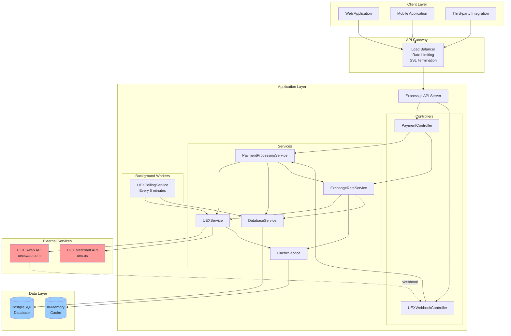
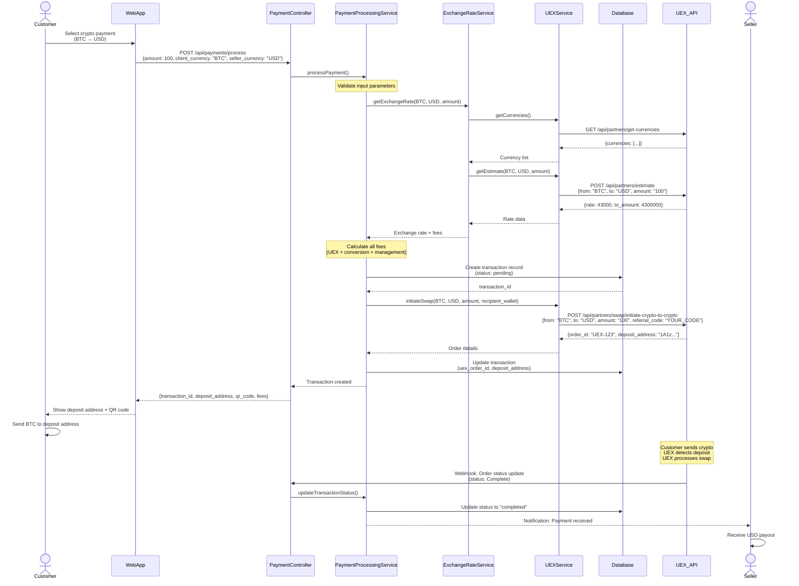
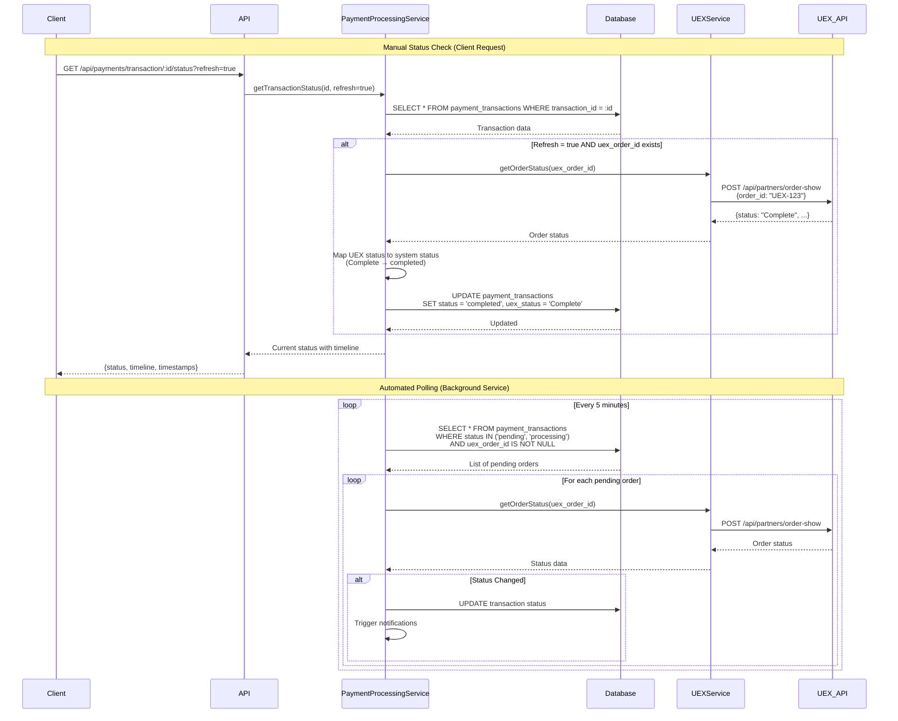
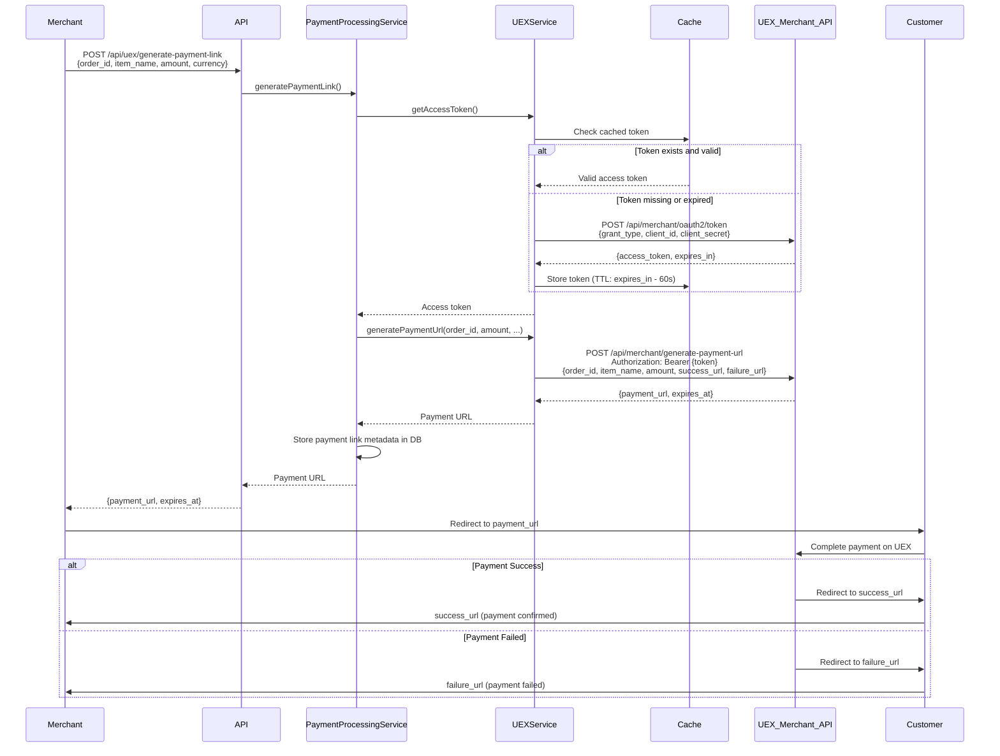
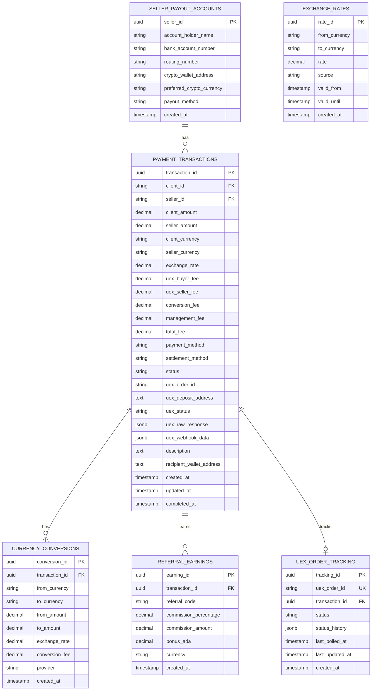
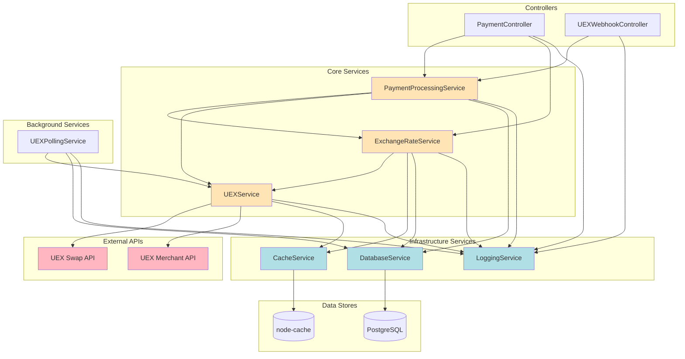
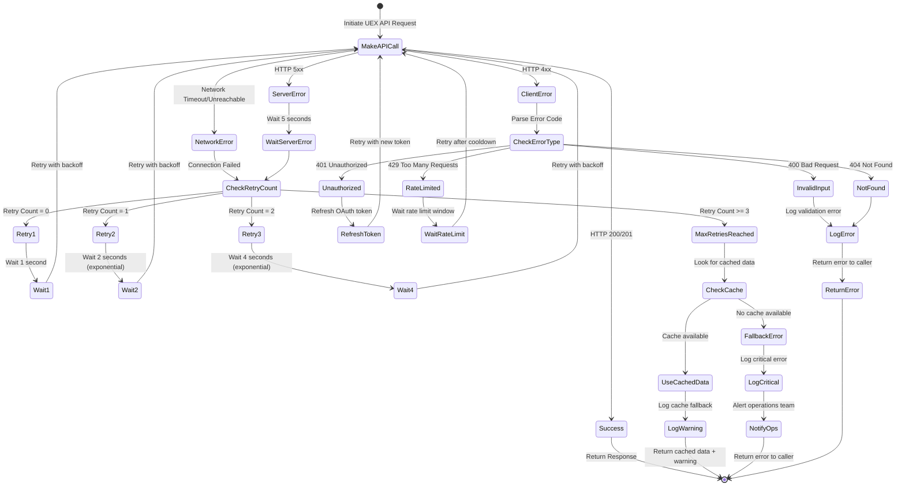
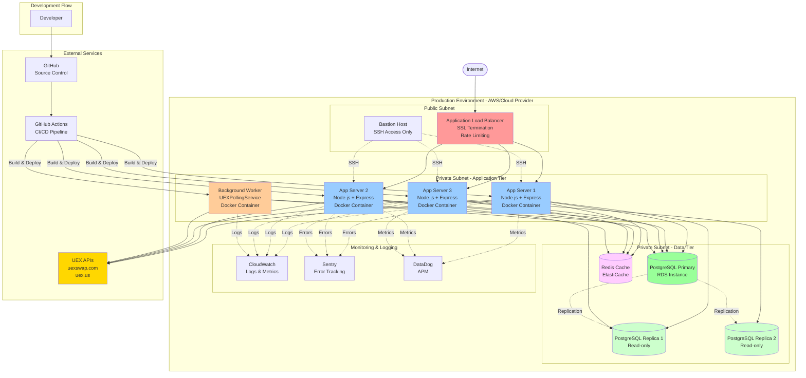

# UEX API Integration - Mermaid Diagrams

**Document Version**: 1.0.0  
**Date**: 2025-10-22  
**Purpose**: Visual diagrams showing API integration flows and system architecture

---

## Table of Contents

1. [System Architecture Overview](#1-system-architecture-overview)
2. [Complete Payment Processing Flow](#2-complete-payment-processing-flow)
3. [Exchange Rate Service Integration](#3-exchange-rate-service-integration)
4. [Crypto Payment Processing Flow](#4-crypto-payment-processing-flow)
5. [Order Status Tracking Flow](#5-order-status-tracking-flow)
6. [Webhook Integration Flow](#6-webhook-integration-flow)
7. [Polling Service Architecture](#7-polling-service-architecture)
8. [Merchant Payment Link Flow](#8-merchant-payment-link-flow)
9. [Database Schema Relationships](#9-database-schema-relationships)
10. [Service Component Dependencies](#10-service-component-dependencies)
11. [Error Handling and Retry Logic](#11-error-handling-and-retry-logic)
12. [Security and Authentication Flow](#12-security-and-authentication-flow)
13. [Fee Calculation Process](#13-fee-calculation-process)
14. [Multi-Currency Conversion Flow](#14-multi-currency-conversion-flow)
15. [Deployment Architecture](#15-deployment-architecture)

---

## 1. System Architecture Overview



---

## 2. Complete Payment Processing Flow



---

## 3. Exchange Rate Service Integration

```mermaid
graph TB
    subgraph "Exchange Rate Service Flow"
        START[Client Request:<br/>Get Exchange Rate]
        
        START --> CHECK_CACHE{Check<br/>Cache}
        
        CHECK_CACHE -->|Cache Hit<br/>< 1 min old| RETURN_CACHED[Return Cached Rate]
        CHECK_CACHE -->|Cache Miss<br/>or Expired| FETCH_CURRENCIES
        
        FETCH_CURRENCIES[UEXService:<br/>getCurrencies]
        FETCH_CURRENCIES --> VALIDATE{Validate<br/>Currency Pair}
        
        VALIDATE -->|Invalid Pair| ERROR[Return Error:<br/>Unsupported Currency]
        VALIDATE -->|Valid Pair| FETCH_ESTIMATE
        
        FETCH_ESTIMATE[UEXService:<br/>getEstimate]
        FETCH_ESTIMATE --> UEX_API_CALL[UEX API:<br/>POST /api/partners/estimate]
        
        UEX_API_CALL --> API_SUCCESS{API<br/>Success?}
        
        API_SUCCESS -->|Success| CALC_FEES[Calculate Platform Fees:<br/>- UEX buyer fee (0.1%)<br/>- UEX seller fee (0.1%)<br/>- Conversion fee (0.2%)<br/>- Management fee (1.0%)]
        API_SUCCESS -->|Failure| FALLBACK{Check<br/>Old Cache}
        
        FALLBACK -->|Available| RETURN_OLD[Return Old Cached Rate<br/>+ Warning]
        FALLBACK -->|Not Available| ERROR
        
        CALC_FEES --> STORE_CACHE[Store in Cache<br/>TTL: 1 minute]
        STORE_CACHE --> STORE_DB[Store in Database<br/>for History]
        STORE_DB --> RETURN_RATE[Return Complete Rate Data:<br/>- Exchange rate<br/>- Conversion amount<br/>- Fee breakdown<br/>- Min/Max limits]
        
        RETURN_CACHED --> END[Response to Client]
        RETURN_RATE --> END
        RETURN_OLD --> END
        ERROR --> END
    end

    style START fill:#90EE90
    style END fill:#FFB6C1
    style ERROR fill:#FF6B6B
    style UEX_API_CALL fill:#87CEEB
```

---

## 4. Crypto Payment Processing Flow

```mermaid
flowchart TD
    START([Payment Request Received])
    
    START --> VALIDATE[Validate Request:<br/>- client_id, seller_id<br/>- amount > 0<br/>- valid currencies<br/>- payment_method = 'crypto']
    
    VALIDATE --> CHECK_CRYPTO{Is Crypto<br/>Payment?}
    
    CHECK_CRYPTO -->|No| EXISTING_FLOW[Use Existing Payment Flow<br/>Credit Card / Bank Transfer]
    CHECK_CRYPTO -->|Yes| GET_RATE
    
    GET_RATE[ExchangeRateService:<br/>Get Exchange Rate]
    GET_RATE --> RATE_SUCCESS{Rate<br/>Retrieved?}
    
    RATE_SUCCESS -->|No| ERROR_RESPONSE[Return Error:<br/>Currency pair not supported]
    RATE_SUCCESS -->|Yes| CALC_AMOUNTS
    
    CALC_AMOUNTS[Calculate Amounts:<br/>1. Client amount in crypto<br/>2. Seller amount in target currency<br/>3. All fees]
    
    CALC_AMOUNTS --> CREATE_TX[Create Transaction in Database:<br/>- status: 'pending'<br/>- all amounts and fees<br/>- currencies<br/>- client/seller IDs]
    
    CREATE_TX --> DB_SUCCESS{Database<br/>Insert OK?}
    
    DB_SUCCESS -->|No| ROLLBACK[Rollback Transaction<br/>Return Error]
    DB_SUCCESS -->|Yes| DETERMINE_SWAP
    
    DETERMINE_SWAP{Settlement<br/>Method?}
    
    DETERMINE_SWAP -->|blockchain| CRYPTO_TO_CRYPTO[UEXService:<br/>initiateSwap<br/>crypto-to-crypto]
    DETERMINE_SWAP -->|bank| CRYPTO_TO_FIAT[UEXService:<br/>initiateSwap<br/>crypto-to-fiat]
    
    CRYPTO_TO_CRYPTO --> CALL_UEX_CRYPTO[UEX API:<br/>POST /swap/initiate-crypto-to-crypto]
    CRYPTO_TO_FIAT --> CALL_UEX_FIAT[UEX API:<br/>POST /swap/initiate-crypto-to-fiat]
    
    CALL_UEX_CRYPTO --> UEX_SUCCESS{UEX API<br/>Success?}
    CALL_UEX_FIAT --> UEX_SUCCESS
    
    UEX_SUCCESS -->|No| UPDATE_FAILED[Update Transaction:<br/>status = 'failed'<br/>error_message]
    UEX_SUCCESS -->|Yes| UPDATE_PENDING
    
    UPDATE_FAILED --> ERROR_RESPONSE
    
    UPDATE_PENDING[Update Transaction:<br/>- uex_order_id<br/>- deposit_address<br/>- status: 'pending']
    
    UPDATE_PENDING --> GENERATE_QR[Generate QR Code:<br/>for deposit address]
    
    GENERATE_QR --> RETURN_SUCCESS[Return Success Response:<br/>- transaction_id<br/>- deposit_address<br/>- QR code URL<br/>- fee breakdown<br/>- estimated completion time]
    
    RETURN_SUCCESS --> WAIT_DEPOSIT[Wait for Customer<br/>to Send Crypto]
    
    WAIT_DEPOSIT --> WEBHOOK_OR_POLL{Status<br/>Update Via}
    
    WEBHOOK_OR_POLL -->|Webhook| WEBHOOK_UPDATE[UEX sends webhook<br/>to /api/uex/webhook]
    WEBHOOK_OR_POLL -->|Polling| POLL_UPDATE[Polling service checks<br/>every 5 minutes]
    
    WEBHOOK_UPDATE --> UPDATE_STATUS[Update Transaction Status:<br/>- processing → completed<br/>- Update timestamps]
    POLL_UPDATE --> UPDATE_STATUS
    
    UPDATE_STATUS --> NOTIFY_SELLER[Notify Seller:<br/>Payment Received]
    
    NOTIFY_SELLER --> PAYOUT[Process Seller Payout:<br/>Amount - Fees]
    
    PAYOUT --> END([Payment Complete])
    
    EXISTING_FLOW --> END
    ROLLBACK --> END
    ERROR_RESPONSE --> END

    style START fill:#90EE90
    style END fill:#FFB6C1
    style ERROR_RESPONSE fill:#FF6B6B
    style CALL_UEX_CRYPTO fill:#87CEEB
    style CALL_UEX_FIAT fill:#87CEEB
```



---

## 5. Order Status Tracking Flow



---

## 6. Webhook Integration Flow

```mermaid
flowchart TD
    START([UEX Webhook Received])
    
    START --> WEBHOOK_POST[POST /api/uex/webhook/order-status<br/>Body: {order_id, status, metadata}]
    
    WEBHOOK_POST --> VALIDATE_SIG{Validate<br/>Signature?}
    
    VALIDATE_SIG -->|Invalid| RETURN_400[Return 400 Bad Request]
    VALIDATE_SIG -->|Valid or No Sig| PARSE_BODY
    
    PARSE_BODY[Parse Request Body:<br/>- order_id<br/>- status<br/>- amounts<br/>- timestamp]
    
    PARSE_BODY --> VALIDATE_DATA{Data<br/>Valid?}
    
    VALIDATE_DATA -->|No| RETURN_400
    VALIDATE_DATA -->|Yes| FIND_TX
    
    FIND_TX[Database:<br/>Find transaction by uex_order_id]
    
    FIND_TX --> TX_FOUND{Transaction<br/>Found?}
    
    TX_FOUND -->|No| LOG_ERROR[Log Warning:<br/>Unknown order_id]
    TX_FOUND -->|Yes| MAP_STATUS
    
    LOG_ERROR --> RETURN_404[Return 404 Not Found]
    
    MAP_STATUS[Map UEX Status to System Status:<br/>- Awaiting Deposit → pending<br/>- Confirming Deposit → processing<br/>- Exchanging → processing<br/>- Sending → processing<br/>- Complete → completed<br/>- Failed → failed<br/>- Refund → cancelled]
    
    MAP_STATUS --> CHECK_CHANGE{Status<br/>Changed?}
    
    CHECK_CHANGE -->|No Change| LOG_DUPLICATE[Log: Duplicate webhook]
    CHECK_CHANGE -->|Changed| UPDATE_TX
    
    LOG_DUPLICATE --> RETURN_200A[Return 200 OK]
    
    UPDATE_TX[Update Transaction:<br/>- status<br/>- uex_status<br/>- uex_webhook_data (JSON)<br/>- updated_at<br/>- completed_at if completed]
    
    UPDATE_TX --> APPEND_HISTORY[Append to status_history:<br/>{status, timestamp}]
    
    APPEND_HISTORY --> TX_COMPLETED{Status =<br/>completed?}
    
    TX_COMPLETED -->|Yes| NOTIFY_SELLER[Notify Seller:<br/>Payment Received]
    TX_COMPLETED -->|No| SKIP_NOTIFY
    
    NOTIFY_SELLER --> UPDATE_METRICS
    SKIP_NOTIFY[Skip Notification] --> UPDATE_METRICS
    
    UPDATE_METRICS[Update Metrics:<br/>- Transaction counts<br/>- Completion times<br/>- Success rates]
    
    UPDATE_METRICS --> LOG_SUCCESS[Log Webhook Processing:<br/>Success]
    
    LOG_SUCCESS --> RETURN_200[Return 200 OK]
    
    RETURN_400 --> END([End])
    RETURN_404 --> END
    RETURN_200A --> END
    RETURN_200 --> END

    style START fill:#90EE90
    style END fill:#FFB6C1
    style RETURN_400 fill:#FF6B6B
    style RETURN_404 fill:#FF6B6B
    style RETURN_200 fill:#90EE90
    style RETURN_200A fill:#90EE90
```

---

## 7. Polling Service Architecture

```mermaid
graph TB
    subgraph "UEXPollingService - Background Worker"
        TIMER[Timer Trigger<br/>Every 5 Minutes]
        
        TIMER --> START[Start Polling Cycle]
        
        START --> QUERY_PENDING[Database Query:<br/>SELECT * FROM payment_transactions<br/>WHERE status IN ('pending', 'processing')<br/>AND uex_order_id IS NOT NULL<br/>AND created_at > NOW() - INTERVAL '7 days']
        
        QUERY_PENDING --> CHECK_RESULTS{Pending<br/>Orders?}
        
        CHECK_RESULTS -->|None| LOG_NONE[Log: No pending orders]
        CHECK_RESULTS -->|Found| ITERATE
        
        LOG_NONE --> WAIT[Wait 5 Minutes]
        
        ITERATE[For Each Order:<br/>Process Sequentially]
        
        ITERATE --> GET_STATUS[UEXService:<br/>getOrderStatus<br/>(uex_order_id)]
        
        GET_STATUS --> API_CALL[UEX API Call:<br/>POST /api/partners/order-show]
        
        API_CALL --> API_SUCCESS{API Call<br/>Success?}
        
        API_SUCCESS -->|Error| LOG_ERROR[Log Error:<br/>API call failed<br/>Continue to next order]
        API_SUCCESS -->|Success| COMPARE
        
        LOG_ERROR --> NEXT_ORDER{More<br/>Orders?}
        
        COMPARE[Compare Status:<br/>UEX status vs DB status]
        
        COMPARE --> STATUS_CHANGED{Status<br/>Changed?}
        
        STATUS_CHANGED -->|No| LOG_UNCHANGED[Log: Status unchanged]
        STATUS_CHANGED -->|Yes| UPDATE_DB
        
        LOG_UNCHANGED --> UPDATE_POLL_TIME
        
        UPDATE_DB[Update Database:<br/>- status<br/>- uex_status<br/>- updated_at<br/>- completed_at if done]
        
        UPDATE_DB --> APPEND_HISTORY[Append to status_history]
        
        APPEND_HISTORY --> CHECK_COMPLETED{Status =<br/>completed?}
        
        CHECK_COMPLETED -->|Yes| NOTIFY[Notify Seller:<br/>Payment Completed]
        CHECK_COMPLETED -->|No| SKIP_NOTIFY
        
        NOTIFY --> RECORD_METRICS
        SKIP_NOTIFY[Skip Notification] --> RECORD_METRICS
        
        RECORD_METRICS[Record Metrics:<br/>- Poll count<br/>- Status change count<br/>- Processing time]
        
        RECORD_METRICS --> UPDATE_POLL_TIME
        
        UPDATE_POLL_TIME[Update last_polled_at<br/>in uex_order_tracking]
        
        UPDATE_POLL_TIME --> NEXT_ORDER
        
        NEXT_ORDER -->|Yes| ITERATE
        NEXT_ORDER -->|No| COMPLETE
        
        COMPLETE[Log Polling Complete:<br/>Total orders processed<br/>Total updates made]
        
        COMPLETE --> WAIT
        WAIT --> TIMER
    end

    style TIMER fill:#90EE90
    style API_CALL fill:#87CEEB
    style LOG_ERROR fill:#FFD700
```

---

## 8. Merchant Payment Link Flow



---

## 9. Database Schema Relationships



---

## 10. Service Component Dependencies



---

## 11. Error Handling and Retry Logic



---

## 12. Security and Authentication Flow

```mermaid
flowchart TB
    START([Client Request])
    
    START --> CHECK_HTTPS{HTTPS<br/>Enabled?}
    
    CHECK_HTTPS -->|No| REJECT_HTTP[Reject: Upgrade to HTTPS]
    CHECK_HTTPS -->|Yes| RATE_LIMIT
    
    RATE_LIMIT[Check Rate Limit:<br/>IP-based throttling]
    
    RATE_LIMIT --> LIMIT_OK{Under<br/>Limit?}
    
    LIMIT_OK -->|No| REJECT_RATE[Reject: 429 Too Many Requests]
    LIMIT_OK -->|Yes| CHECK_AUTH
    
    CHECK_AUTH{Endpoint<br/>Requires Auth?}
    
    CHECK_AUTH -->|No| VALIDATE_INPUT
    CHECK_AUTH -->|Yes| EXTRACT_TOKEN
    
    EXTRACT_TOKEN[Extract JWT from:<br/>Authorization header<br/>or Cookie]
    
    EXTRACT_TOKEN --> TOKEN_EXISTS{Token<br/>Present?}
    
    TOKEN_EXISTS -->|No| REJECT_UNAUTH[Reject: 401 Unauthorized]
    TOKEN_EXISTS -->|Yes| VERIFY_TOKEN
    
    VERIFY_TOKEN[Verify JWT:<br/>- Signature (RS256)<br/>- Expiration<br/>- Issuer]
    
    VERIFY_TOKEN --> TOKEN_VALID{Token<br/>Valid?}
    
    TOKEN_VALID -->|No| REJECT_INVALID[Reject: 401 Invalid Token]
    TOKEN_VALID -->|Yes| CHECK_ROLE
    
    CHECK_ROLE[Extract Role from Claims:<br/>admin, seller, customer]
    
    CHECK_ROLE --> AUTHORIZE{User Has<br/>Permission?}
    
    AUTHORIZE -->|No| REJECT_FORBIDDEN[Reject: 403 Forbidden]
    AUTHORIZE -->|Yes| VALIDATE_INPUT
    
    VALIDATE_INPUT[Validate Input:<br/>- Sanitize strings<br/>- Validate types<br/>- Check ranges<br/>- Prevent injection]
    
    VALIDATE_INPUT --> INPUT_VALID{Input<br/>Valid?}
    
    INPUT_VALID -->|No| REJECT_INPUT[Reject: 400 Bad Request]
    INPUT_VALID -->|Yes| PROCESS
    
    PROCESS[Process Request:<br/>Business Logic]
    
    PROCESS --> CHECK_SENSITIVE{Response<br/>Has Sensitive Data?}
    
    CHECK_SENSITIVE -->|Yes| MASK_DATA[Mask Sensitive Fields:<br/>- Wallet addresses<br/>- API keys<br/>- Personal info]
    CHECK_SENSITIVE -->|No| LOG_REQUEST
    
    MASK_DATA --> LOG_REQUEST
    
    LOG_REQUEST[Log Request:<br/>- Method, Path, User ID<br/>- Response status<br/>- Duration<br/>NO sensitive data]
    
    LOG_REQUEST --> RETURN_RESPONSE[Return Response:<br/>+ Security Headers<br/>+ CORS Headers]
    
    RETURN_RESPONSE --> END([Response Sent])
    
    REJECT_HTTP --> END
    REJECT_RATE --> END
    REJECT_UNAUTH --> END
    REJECT_INVALID --> END
    REJECT_FORBIDDEN --> END
    REJECT_INPUT --> END

    style START fill:#90EE90
    style END fill:#FFB6C1
    style REJECT_HTTP fill:#FF6B6B
    style REJECT_RATE fill:#FF6B6B
    style REJECT_UNAUTH fill:#FF6B6B
    style REJECT_INVALID fill:#FF6B6B
    style REJECT_FORBIDDEN fill:#FF6B6B
    style REJECT_INPUT fill:#FF6B6B
    style PROCESS fill:#87CEEB
```

---

## 13. Fee Calculation Process

```mermaid
graph TB
    START([Calculate Transaction Fees])
    
    START --> INPUT[Input Parameters:<br/>- Client Amount<br/>- Client Currency<br/>- Seller Currency<br/>- Exchange Rate<br/>- Payment Method]
    
    INPUT --> CONVERT[Convert Amount:<br/>Converted Amount = Client Amount × Exchange Rate]
    
    CONVERT --> CALC_UEX_BUYER[Calculate UEX Buyer Fee:<br/>Fee = Client Amount × 0.001<br/>Min: $0.001, Max: $100]
    
    CALC_UEX_BUYER --> CALC_UEX_SELLER[Calculate UEX Seller Fee:<br/>Fee = Converted Amount × 0.001<br/>Min: $0.001, Max: $100]
    
    CALC_UEX_SELLER --> CHECK_CURRENCY{Client Currency<br/>≠ Seller Currency?}
    
    CHECK_CURRENCY -->|Yes| CALC_CONVERSION[Calculate Conversion Fee:<br/>Fee = Converted Amount × 0.002<br/>(0.2%)]
    CHECK_CURRENCY -->|No| NO_CONVERSION[Conversion Fee = 0]
    
    CALC_CONVERSION --> CALC_MGMT
    NO_CONVERSION --> CALC_MGMT
    
    CALC_MGMT[Calculate Management Fee:<br/>Buyer Part = Client Amount × 0.005<br/>Seller Part = Converted Amount × 0.005<br/>Total = Buyer Part + Seller Part<br/>(1.0% total)]
    
    CALC_MGMT --> SUM_FEES[Sum All Fees:<br/>Total Fee = UEX Buyer Fee +<br/>UEX Seller Fee +<br/>Conversion Fee +<br/>Management Fee]
    
    SUM_FEES --> CALC_SELLER[Calculate Seller Amount:<br/>Seller Amount = Converted Amount -<br/>UEX Seller Fee -<br/>Conversion Fee -<br/>Management Fee (seller part)]
    
    CALC_SELLER --> CALC_REFERRAL{Has<br/>Referral Code?}
    
    CALC_REFERRAL -->|Yes| CALC_COMMISSION[Calculate Referral Commission:<br/>Commission = Converted Amount × 0.0019<br/>(0.19%)<br/><br/>If Cardano:<br/>Bonus = 0.5 ADA]
    CALC_REFERRAL -->|No| NO_REFERRAL[Referral Commission = 0]
    
    CALC_COMMISSION --> PREPARE_BREAKDOWN
    NO_REFERRAL --> PREPARE_BREAKDOWN
    
    PREPARE_BREAKDOWN[Prepare Fee Breakdown:<br/>- UEX Buyer Fee: X<br/>- UEX Seller Fee: X<br/>- Conversion Fee: X<br/>- Management Fee: X<br/>- Total Fee: X<br/>- Referral Commission: X<br/>- Final Seller Amount: X]
    
    PREPARE_BREAKDOWN --> RETURN[Return Fee Object]
    
    RETURN --> END([End])

    style START fill:#90EE90
    style END fill:#FFB6C1
    style CALC_UEX_BUYER fill:#FFE4B5
    style CALC_UEX_SELLER fill:#FFE4B5
    style CALC_CONVERSION fill:#FFE4B5
    style CALC_MGMT fill:#FFE4B5
    style CALC_COMMISSION fill:#98FB98
```

---

## 14. Multi-Currency Conversion Flow

```mermaid
flowchart LR
    subgraph "Client Side"
        CLIENT[Client Pays<br/>in BTC]
    end
    
    subgraph "System Processing"
        direction TB
        
        RECEIVE[Receive Payment Request:<br/>100 USD worth of BTC<br/>to be paid to seller]
        
        GET_RATE[Get Exchange Rate:<br/>BTC/USD = 43,000<br/>Amount: 0.00233 BTC]
        
        CALC1[Calculate Required BTC:<br/>100 USD ÷ 43,000 = 0.00233 BTC]
        
        SELLER_CURRENCY{Seller<br/>Currency?}
        
        SELLER_CURRENCY -->|USD| SCENARIO_A[Scenario A:<br/>BTC → USD<br/>Crypto to Fiat]
        SELLER_CURRENCY -->|BTC| SCENARIO_B[Scenario B:<br/>BTC → BTC<br/>Same Currency]
        SELLER_CURRENCY -->|ETH| SCENARIO_C[Scenario C:<br/>BTC → ETH<br/>Crypto to Crypto]
        
        SCENARIO_A --> UEX_FIAT[UEX API:<br/>initiate-crypto-to-fiat<br/>BTC → USD]
        
        SCENARIO_B --> NO_CONVERSION[No Conversion Needed:<br/>Direct transfer<br/>No UEX swap]
        
        SCENARIO_C --> UEX_CRYPTO[UEX API:<br/>initiate-crypto-to-crypto<br/>BTC → ETH]
        
        UEX_FIAT --> DEPOSIT_A[Client deposits BTC<br/>to UEX address]
        NO_CONVERSION --> DEPOSIT_B[Client deposits BTC<br/>to seller wallet]
        UEX_CRYPTO --> DEPOSIT_C[Client deposits BTC<br/>to UEX address]
        
        DEPOSIT_A --> SWAP_A[UEX swaps BTC to USD]
        DEPOSIT_C --> SWAP_C[UEX swaps BTC to ETH]
        
        SWAP_A --> PAYOUT_A[Seller receives USD<br/>via bank transfer]
        DEPOSIT_B --> PAYOUT_B[Seller receives BTC<br/>in wallet]
        SWAP_C --> PAYOUT_C[Seller receives ETH<br/>in wallet]
    end
    
    subgraph "Seller Side"
        SELLER_A[Seller gets USD<br/>in bank account]
        SELLER_B[Seller gets BTC<br/>in wallet]
        SELLER_C[Seller gets ETH<br/>in wallet]
    end
    
    CLIENT --> RECEIVE
    RECEIVE --> GET_RATE
    GET_RATE --> CALC1
    CALC1 --> SELLER_CURRENCY
    
    PAYOUT_A --> SELLER_A
    PAYOUT_B --> SELLER_B
    PAYOUT_C --> SELLER_C

    style CLIENT fill:#90EE90
    style SELLER_A fill:#FFB6C1
    style SELLER_B fill:#FFB6C1
    style SELLER_C fill:#FFB6C1
    style UEX_FIAT fill:#87CEEB
    style UEX_CRYPTO fill:#87CEEB
```



---

## 15. Deployment Architecture



---

## 16. Complete System Integration Overview

```mermaid
graph TB
    subgraph "Frontend Applications"
        WEB[Web Application]
        MOBILE[Mobile App]
        ADMIN[Admin Dashboard]
    end
    
    subgraph "API Gateway Layer"
        LB[Load Balancer<br/>+ Rate Limiting]
    end
    
    subgraph "Application Server - Express.js"
        direction TB
        
        subgraph "API Routes"
            PAYMENT_ROUTES[/api/payments/*]
            UEX_ROUTES[/api/uex/*]
            EXCHANGE_ROUTES[/api/exchange-rates/*]
        end
        
        subgraph "Controllers"
            PC[PaymentController<br/>- processPayment<br/>- getStatus<br/>- getTransactions]
            
            WC[UEXWebhookController<br/>- handleOrderStatus<br/>- pollOrderStatus]
        end
        
        subgraph "Services"
            PPS[PaymentProcessingService<br/>- Validate requests<br/>- Create transactions<br/>- Process payments<br/>- Update statuses]
            
            ERS[ExchangeRateService<br/>- Get currencies<br/>- Get exchange rates<br/>- Cache management<br/>- Fallback logic]
            
            UXS[UEXService<br/>- API client wrapper<br/>- Error handling<br/>- Retry logic<br/>- Token management]
            
            DBS[DatabaseService<br/>- CRUD operations<br/>- Transaction management<br/>- Connection pooling]
            
            CS[CacheService<br/>- In-memory cache<br/>- TTL management<br/>- Cache invalidation]
        end
        
        subgraph "Background Workers"
            POLL[UEXPollingService<br/>Every 5 minutes:<br/>- Poll pending orders<br/>- Update statuses<br/>- Trigger notifications]
        end
    end
    
    subgraph "External APIs"
        UEX_SWAP[UEX Swap API<br/>api.uexswap.com<br/><br/>Endpoints:<br/>- get-currencies<br/>- estimate<br/>- initiate-crypto-to-crypto<br/>- order-show]
        
        UEX_MERCHANT[UEX Merchant API<br/>uex.us<br/><br/>Endpoints:<br/>- oauth2/token<br/>- generate-payment-url]
    end
    
    subgraph "Data Layer"
        PG[(PostgreSQL Database<br/><br/>Tables:<br/>- payment_transactions<br/>- currency_conversions<br/>- exchange_rates<br/>- uex_order_tracking<br/>- referral_earnings<br/>- seller_payout_accounts)]
        
        CACHE_STORE[(In-Memory Cache<br/>node-cache<br/><br/>Cached:<br/>- Exchange rates 1min<br/>- Currency list 1hr<br/>- OAuth tokens 1hr)]
    end
    
    subgraph "Monitoring & Observability"
        LOGS[Logging Service<br/>Winston + CloudWatch]
        METRICS[Metrics Dashboard<br/>DataDog / Prometheus]
        ALERTS[Alert Manager<br/>PagerDuty / Slack]
    end
    
    %% Frontend to API Gateway
    WEB --> LB
    MOBILE --> LB
    ADMIN --> LB
    
    %% API Gateway to Routes
    LB --> PAYMENT_ROUTES
    LB --> UEX_ROUTES
    LB --> EXCHANGE_ROUTES
    
    %% Routes to Controllers
    PAYMENT_ROUTES --> PC
    UEX_ROUTES --> WC
    EXCHANGE_ROUTES --> PC
    
    %% Controllers to Services
    PC --> PPS
    PC --> ERS
    WC --> PPS
    
    %% Service Dependencies
    PPS --> ERS
    PPS --> UXS
    PPS --> DBS
    
    ERS --> UXS
    ERS --> CS
    ERS --> DBS
    
    UXS --> CS
    
    %% Background Worker
    POLL --> UXS
    POLL --> DBS
    
    %% Services to Data Layer
    DBS --> PG
    CS --> CACHE_STORE
    
    %% Services to External APIs
    UXS --> UEX_SWAP
    UXS --> UEX_MERCHANT
    
    %% Webhooks (reverse flow)
    UEX_SWAP -.Webhook POST.-> WC
    
    %% Monitoring
    PC -.Logs.-> LOGS
    WC -.Logs.-> LOGS
    PPS -.Logs.-> LOGS
    ERS -.Logs.-> LOGS
    UXS -.Logs.-> LOGS
    POLL -.Logs.-> LOGS
    
    PPS -.Metrics.-> METRICS
    UXS -.Metrics.-> METRICS
    
    LOGS -.Errors.-> ALERTS
    METRICS -.Threshold Breach.-> ALERTS
    
    style WEB fill:#90EE90
    style MOBILE fill:#90EE90
    style ADMIN fill:#90EE90
    style LB fill:#FF9999
    style PC fill:#FFE4B5
    style WC fill:#FFE4B5
    style PPS fill:#87CEEB
    style ERS fill:#87CEEB
    style UXS fill:#87CEEB
    style DBS fill:#B0E0E6
    style CS fill:#B0E0E6
    style UEX_SWAP fill:#FFB6C1
    style UEX_MERCHANT fill:#FFB6C1
    style PG fill:#98FB98
    style CACHE_STORE fill:#FFCCFF
    style POLL fill:#FFCC99
```

---

## Summary

These Mermaid diagrams provide comprehensive visual documentation of:

1. **System Architecture** - High-level overview of all components
2. **Payment Processing** - Complete flow from request to completion
3. **Exchange Rate Service** - Rate fetching and caching logic
4. **Crypto Payments** - Detailed crypto payment processing
5. **Order Tracking** - Manual and automated status updates
6. **Webhooks** - Real-time status update handling
7. **Polling Service** - Background order synchronization
8. **Payment Links** - Merchant API integration flow
9. **Database Schema** - Entity relationships and structure
10. **Service Dependencies** - Component interaction map
11. **Error Handling** - Retry logic and fallback strategies
12. **Security** - Authentication and authorization flow
13. **Fee Calculation** - Detailed fee computation process
14. **Currency Conversion** - Multi-currency scenarios
15. **Deployment** - Production infrastructure architecture
16. **Complete Integration** - End-to-end system overview

All diagrams show how UEX APIs are combined with your existing payment system to fulfill the requirements specified in the Requirements & Specifications document.

---

**How to Use These Diagrams:**

1. Copy any diagram code block
2. Paste into a Mermaid viewer (e.g., mermaid.live, GitHub markdown, or any Mermaid-compatible tool)
3. The diagram will render automatically
4. Use for documentation, presentations, or team discussions

**Rendering Options:**
- GitHub: Paste in .md files (native support)
- VS Code: Install Mermaid extension
- Online: https://mermaid.live
- Documentation: Integrate with MkDocs, Docusaurus, etc.

---

*End of Diagram Document*
